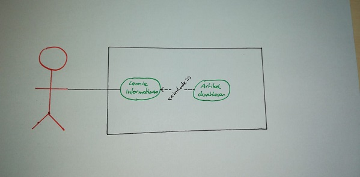
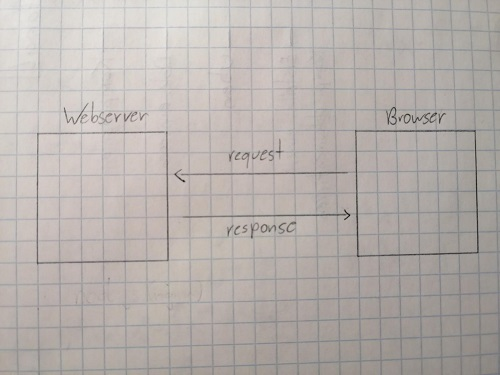

# Website über Leonie
## mit Polymer 
### von Konstantin Frank und David Andraschko

Unsere Aufgabe ist es drei kleine Webseiten, jeweils eine mit GatsbyJS, React und Polymer Project zu erstellen.
Dabei sollen wir Unterschiede, sowie Vor- und Nachteile der verschiedenen Technologien erkennen und 
in einem Referat im Unterricht präsentieren. Nachdem wir dies getan haben werden wir uns für eine der 
oben genannten Technologien entscheiden und damit eine größere Website bauen.

## Anwendungsfalldiagramm 

## Systemarchitektur

## Seite starten
### Npm downloaden
npm install 

### Polymer CLI downloaden
npm install -g polymer-cli

### Website laufen lassen
polymer serve

Link sollte dann folgendermaßen aussehen: http://127.0.0.1:8081/components/leonie-polymer/website/